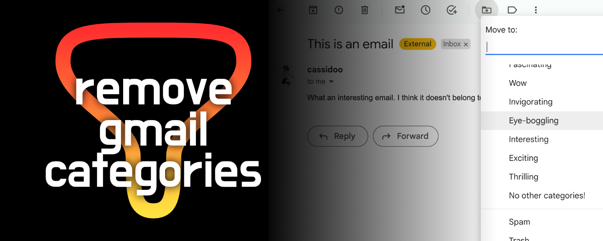

    

# Remove Gmail Categories

A free browser extension that removes the labels Social, Promotions, Updates, and Forums from the Gmail Move dropdown.

(web store links coming soon)

## How to use without any of that webstore nonsense

- Download/clone this repository
- On Edge, go to `edge://extensions`, or on Chrome, go to `chrome://extensions`
- Toggle on "Developer Mode"
- Click the "Load Unpacked" button
- Select the unzipped extension folder
- Look for the lil filter icon (as seen in the image above), and make sure it's toggled on
- And you're installed! To test it, go to Gmail and try to move an email to one of those dreaded categories that you normally can't remove.
- Voilà!
